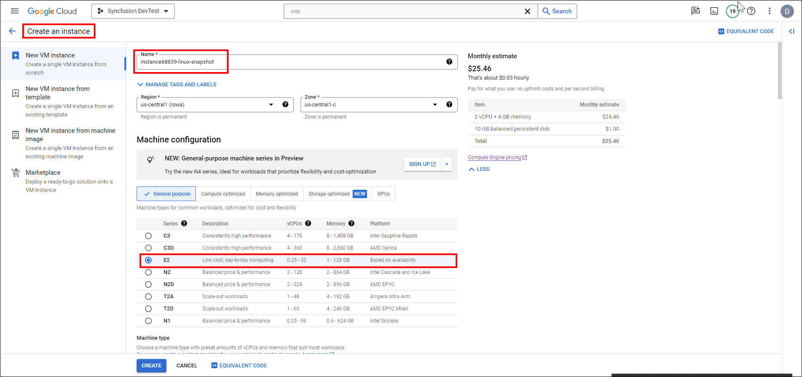

# Steps to Install and Enable Backup Compatibility of Bold BI on GCP Linux instance

| SEO Details       |                                                                     |
|-------------------|---------------------------------------------------------------------|
| Meta Title        | Installing and Enabling Backup Compatibility for Bold BI on  GCP Linux instance |
| Meta Description  | Learn how to install Bold BI on GCP Linux instance and enable backup compatibility with easy-to-follow steps. Ensure data protection and disaster recovery for your Bold BI installation. |

## Below are the steps that will help you to install Bold BI.

### 1. Launch an  Linux instance on GCP
   - To create an Linux instance on GCP, refer to this [link](https://cloud.google.com/compute/docs/create-linux-vm-instance#:~:text=Create%20a%20Linux%20VM%20instance%201%20In%20the,7%20To%20create%20the%20VM%2C%20click%20Create%20).

### 2. Setup Database for PostgreSQL
If you want to set up a PostgreSQL Database on GCP Linux instance, follow the first step. If you prefer using a managed Database in GCP, follow the second step.

#### a. Setting up PostgreSQL in a Linux instance
To install PostgreSQL on Linux, you can use the package manager specific to your distribution. Here are the commands for some common distributions:
1. **Ubuntu/Debian**:
   ```bash
   sudo apt update
   sudo apt install postgresql postgresql-contrib
2. **CentOS/RHEL**:
    ```bash
    sudo yum install postgresql-server postgresql-contrib
    sudo postgresql-setup initdb
    sudo systemctl start postgresql
    sudo systemctl enable postgresql

**Information:**
  - For installing a MySQL database in a Linux instance, refer to the steps outlined in this [guide](https://www.devart.com/dbforge/mysql/how-to-install-mysql-on-linux/).
  - To install an MS SQL database in Linux instance, follow the instructions provided in this [guide](https://phoenixnap.com/kb/sql-server-linux).

#### b. Setting up PostgreSQL Database in GCP
- For instructions on creating a PostgreSQL Database in GCP, please refer to this [link](https://cloud.google.com/sql/docs/postgres/create-instance/). Additionally, you can refer to this [link](https://cloud.google.com/sql/docs/postgres/instance-info) for instance information.

**Information:** 
  - To create a MySQL Database in GCP, you can follow the steps outlined in this [guide](https://cloud.google.com/sql/docs/mysql/create-instance). For information about your instance, refer to this [link](https://cloud.google.com/sql/docs/mysql/instance-info).

  - To create a SQL Database in GCP, refer to this [guide](https://cloud.google.com/sql/docs/sqlserver/create-instance). Additionally, for instance information, you can refer to this [link](https://cloud.google.com/sql/docs/sqlserver/instance-info).


### 3. Bold BI Installation
   - Download different versions of Bold BI from [here](https://www.boldbi.com/account/downloads) and proceed with installation.
   - Refer this [document](https://help.boldbi.com/deploying-bold-bi/deploying-in-linux/installation-and-deployment/bold-bi-on-ubuntu/#bold-bi-installation-and-deployment-on-ubuntu) to install Bold BI in linux
   - For guidance on startup configuration for Bold BI, refer to this [link](https://help.boldbi.com/application-startup/latest/).

**Note:**

During the startup configuration, please remember the name of the database as it will be used in resetting the database.

### 4. DNS Mapping and Binding with Bold BI Application

- Map IP Address to Domain Name
  - Log in to your domain registrar's website.
  - Navigate to the DNS management section.
  - Create an A record that points your domain name to the IP address of your VM.
- When executing the following command to deploy Bold BI on your Linux machine, remember to replace the host URL with your domain name.
   ```bash
      sudo bash install-boldbi.sh -i {new} -u {user} -h {host URL} -n {true or false} 

**Note:**

If you are setting up DNS mapping for your virtual machine (VM), it is essential to also map the snapshot of your VM. Alternatively, if you are not using mapping, you will need to use the upgrade command in the Snapshot VM and replace the host URL with the IP address of your Snapshot VM.

## To Enable Backup compatibility of Bold BI application

### 1. Create a Snapshot of Virtual Machine
-  In the Google Cloud Console, navigate to "Compute Engine" in the left sidebar. Click on the name of the Windows VM instance for which you want to create a snapshot.
- In the left side pane, select the "Snapshots" tab and click on "Create Snapshot". Enter the name of your snapshot and add an optional description. For the source type, select "Disk" since we are taking a snapshot of a disk. Choose the disk you want to snapshot from the "Source disk" dropdown menu. Finally, click the "Create Snapshot" button.In the Location section, choose your snapshot storage location.

- For detailed instructions to create snapshot of your VM, follow the link: [Creating a Windows persistent disk snapshot](https://cloud.google.com/compute/docs/instances/windows/creating-windows-persistent-disk-snapshot)

### 2. Restore the Snapshot of Virtual Machine
- Once you have created the snapshot, it will appear as shown in the image below. Select the "Create instance" button at the top. 

-  You can then enter the details for your restored VM, such as the name, CPU, storage, and region.

- In the boot disk section, verify that your snapshot is selected. If it is not selected, you can change it by clicking "Change". Allow the firewall to access the VM, then click the "Create" button.

- For detailed instructions to create snapshot of your VM, follow the link: [Restoring a Windows snapshot](https://cloud.google.com/compute/docs/disks/restore-snapshot)

**Note:** 
  If you are not using a managed database server, creating a snapshot of your virtual machine is enough.

### 3.PostgreSQL Backup and Restore in GCP (Managed instance)
- Navigate to your created database. In the left pane, select "Backup" and click the "Create Backup" button. 

-  Fill in details such as description and select the location. Click "Create".

- In the backups tab, locate your backup data. Click "Restore". 

- In the "Instance to be overwritten" column, select the target database instance. Enter the instance ID of the target DB. Click "Restore". 


**Note:**

- Before restoring, ensure that you have a target database instance available.
 

## 4. Reset the Connection string to use restored PostgreSQL Database

- To use the restored database, you'll need to reset the database on your Virtual Machine.
Detailed steps can be found in the following documentation: [Reset Application Database on Linux](https://help.boldbi.com/utilities/bold-bi-command-line-tools/reset-application-database/#linux)
